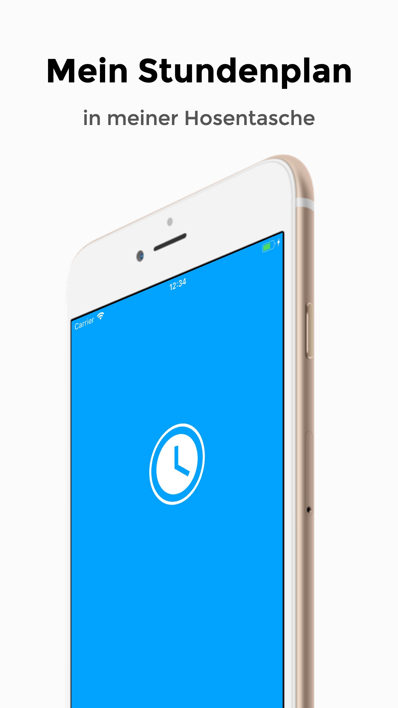
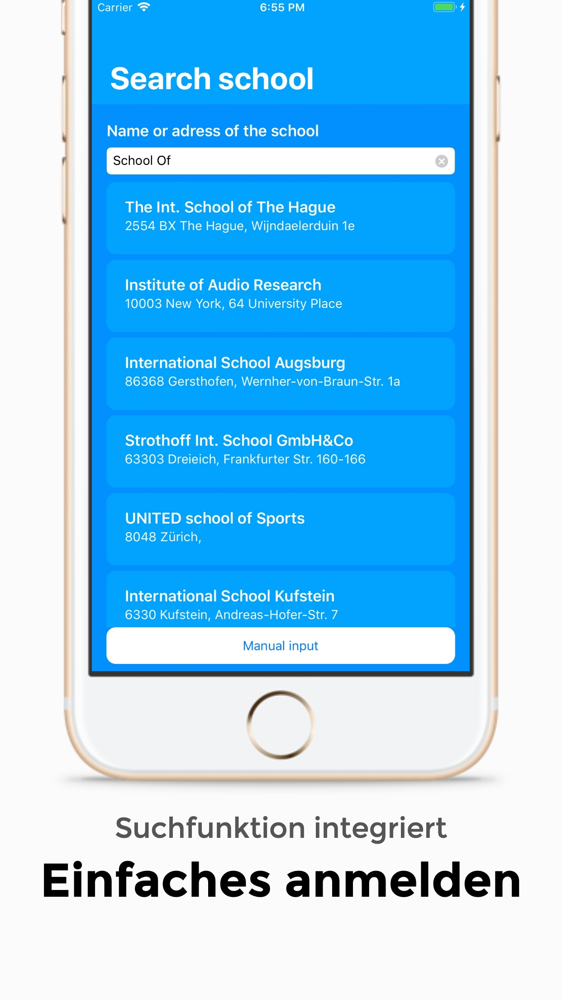
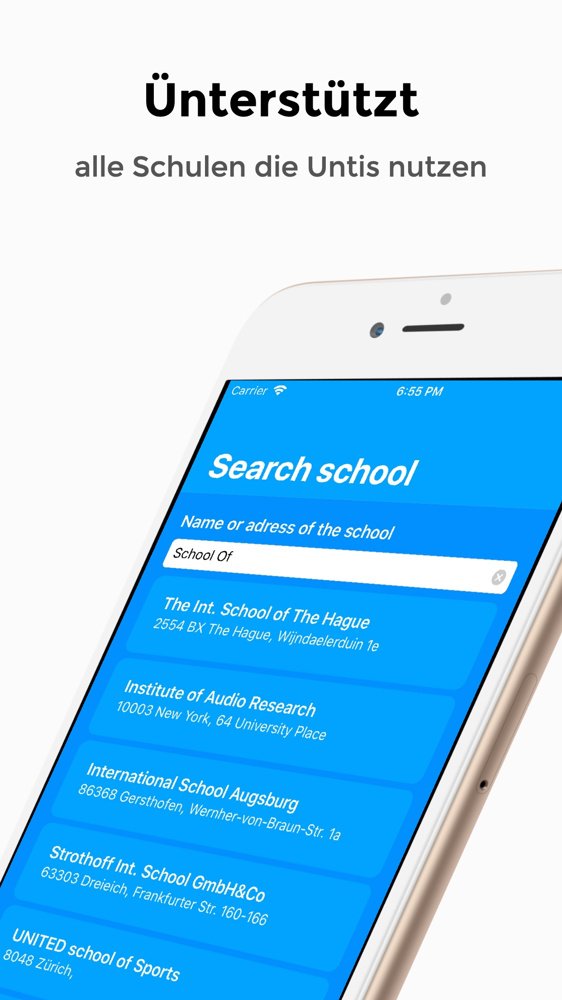
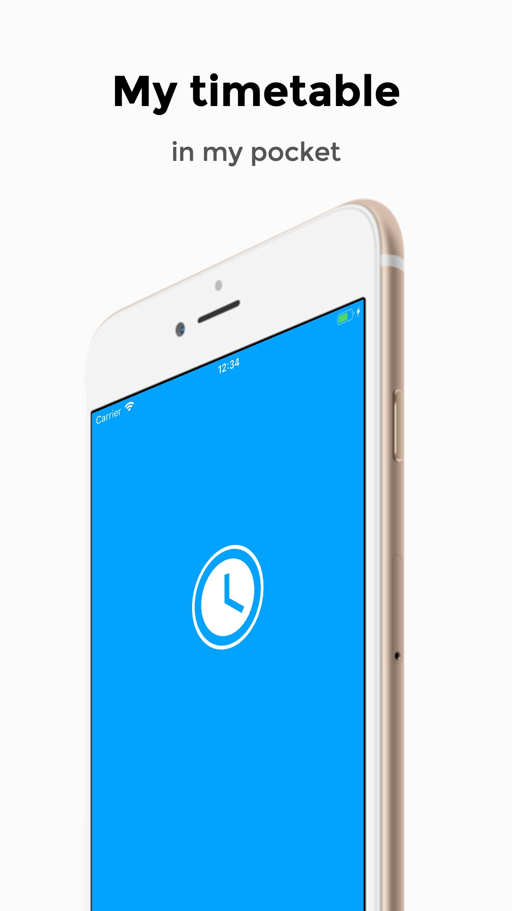
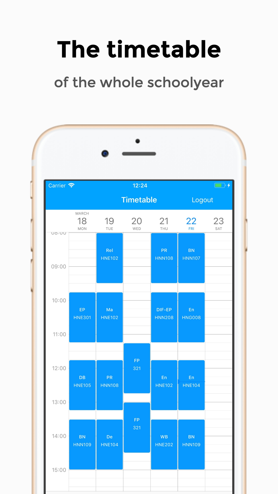
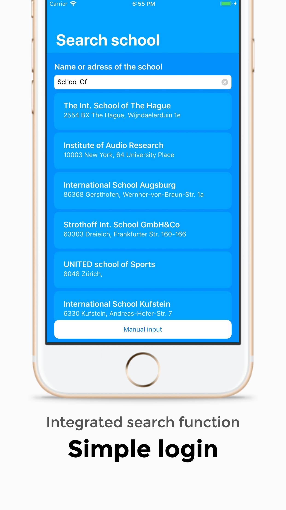
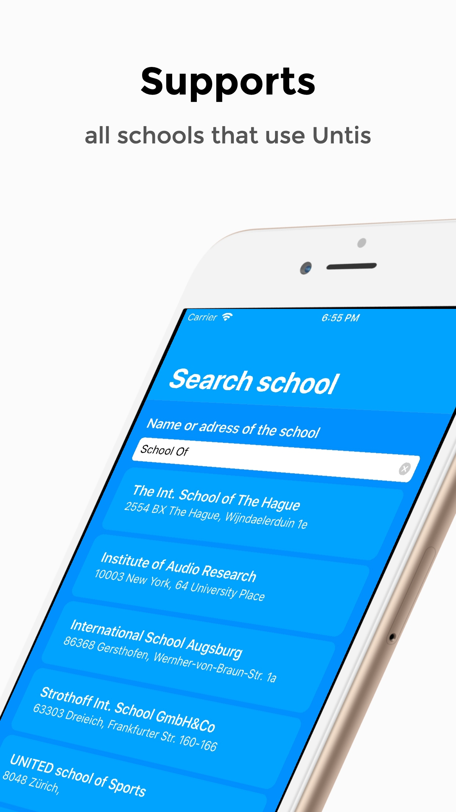

**Warning**
-
This project is an old version of the App "Mein Stundenplan"/"My Timetable".
It is not intended to be used as it is right now. You need to make adjustments.

# Instructions
You need to have a webserver and database running to use this app.
The database structure is in the Webserver folder and named database.sql
The app communicates with your webserver to get the information about the timetables and login information.

# Description
German
-
## Mein Stundenplan
**Dein Stundenplan in deiner Hosentasche**

Mit dieser App kannst du sehen welche Unterrichtsstunden du hast und wirst benachrichtigt sobald sich was am Stundenplan ändert.

Unterstützt werden alle Schulen die **WebUntis** verwenden.

Die App enthält ein **Widget** und eine **Apple Watch-App**

Um sich einzuloggen, wird ein Benutzerkonto der jeweiligen Schule benötigt, anonyme Anmeldungen sind (noch) nicht möglich.

**Screenshots**
||  |||
|--|--|--|--|

English
-
## My Timetable

**Your timetable in your pocket**

With this app you can see what lessons you have and will be notified as soon as something changes on the timetable.

All schools that use **WebUntis** are supported.

The app contains a **Widget** and an **Apple Watch app**

To log in, a user account of the respective school is required, anonymous registrations are not (yet) possible.

**Screenshots**
||  |||
|--|--|--|--|
